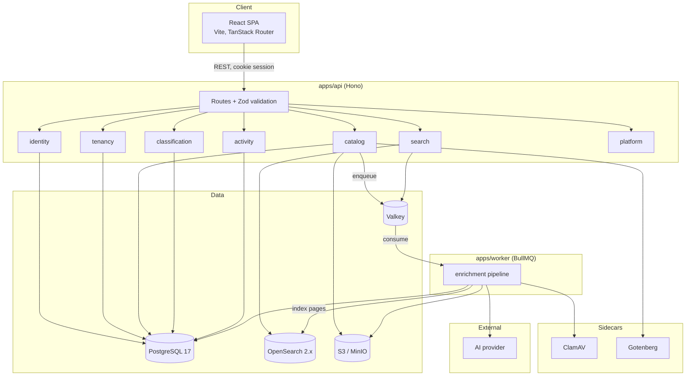
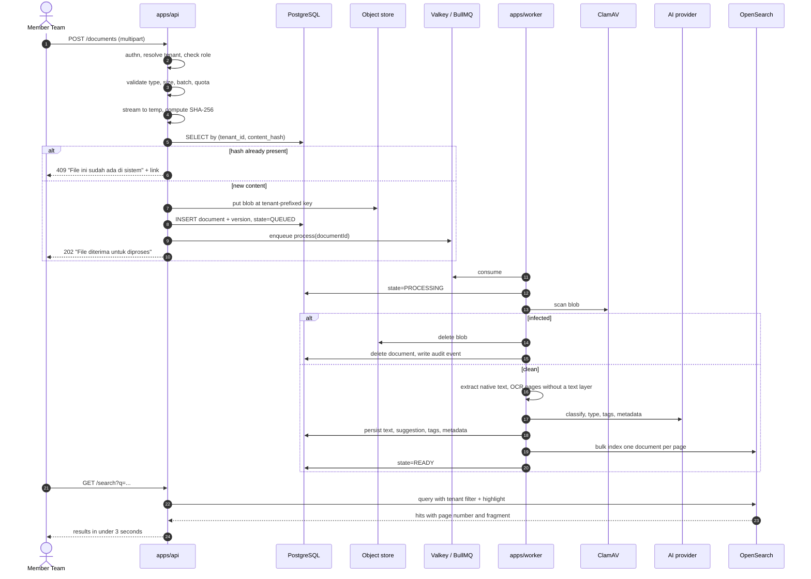
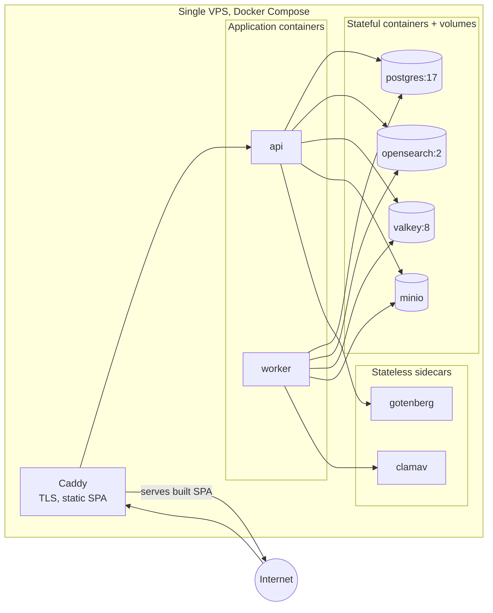

# 02 — System Architecture

**Version:** 1.0  
**Date:** 2026-09-10  
**Author:** Engineering  
**Status:** Approved  
**Phase:** Release 1  

## 2.1 Style: modular monolith plus a worker

One codebase, two deployables. `apps/api` serves HTTP through Hono. `apps/worker` consumes BullMQ queues. Both import the same modules from `packages/`, both talk to the same PostgreSQL instance, neither talks to the other over the network.

### 2.1.1 Why this shape

Archiva has exactly one workload that differs in kind from the rest. OCR and AI inference are slow, CPU-heavy, and bursty: a single 50-page scanned PDF can occupy a core for a minute. Everything else, upload, search, permission checks, audit reads, analytics, is ordinary request and response work against one shared database.

Splitting that one workload onto its own process buys real isolation. AC-33.01 promises search results in under 3 seconds; without a separate worker, that promise is hostage to whatever someone just uploaded.

Splitting the *rest* into services buys nothing here and costs a great deal. Upload-then-index would become a cross-service transaction. Debugging one upload would require distributed tracing. Every on-premises customer under the roadmap US-31 would need to run eight containers instead of two.

US-16 uses the phrase "modul microservice per tenant". That story is roadmap, and its actual requirement is per-tenant module gating, which is a flag check at route registration. A module does not need to be a process to be switched off.

### 2.1.2 Module boundary rule

Modules are packages under `packages/`. Each exposes a single public entry point. **A module never imports another module's internals.** Cross-module calls go through the exporting module's public surface, documented in `05-module-definitions.md`. Enforced by lint rule, not convention.

## 2.2 Component graph

## 2.3 Request lifecycle: upload through to searchable

## 2.4 Deployment graph

The same compose file is the on-premises artifact under the roadmap US-31. A customer runs it on their own hardware, swapping the AI provider adapter for the self-hosted one.

## 2.5 Boundary map

| Module | Owns tables | Depends on (public surface only) | External seam |
|---|---|---|---|
| `tenancy` | tenants, tenant_config | none | none |
| `identity` | users, sessions | tenancy | none |
| `catalog` | documents, document_versions | tenancy, classification, activity | BlobStore, DocumentConverter |
| `classification` | categories, category_permissions | tenancy, activity | none |
| `enrichment` | document_text, document_tags, ai_field_overrides | catalog, classification, search | TextExtractor, AiProvider, MalwareScanner |
| `search` | none, owns the OpenSearch index | tenancy | SearchIndex |
| `activity` | audit_events, analytics_rollups | tenancy | none |
| `platform` | none | all, for health checks only | every port, for readiness |

No cycles. `enrichment` depends on `catalog`, never the reverse: `catalog` publishes a job and forgets it.
