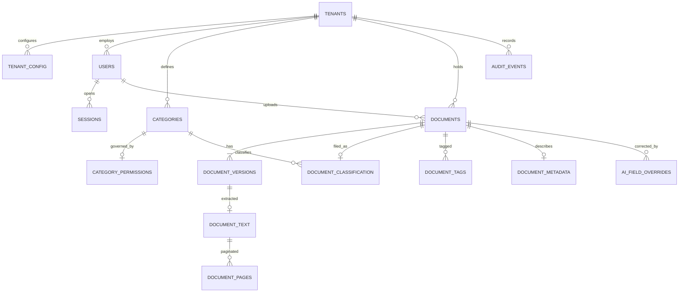
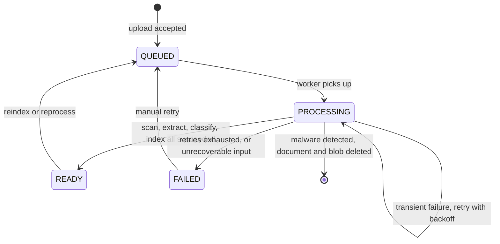
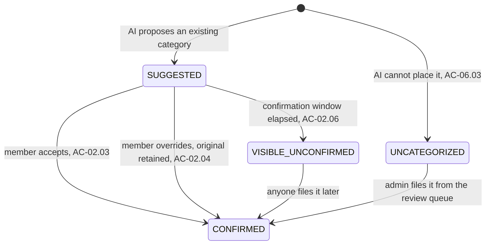

# 06 — Data Model

**Version:** 1.0  
**Date:** 2026-09-10  
**Author:** Engineering  
**Status:** Approved  
**Phase:** Release 1  

PostgreSQL 17, Drizzle schema under `packages/db/src/schema/`, one file per owning module.

## 6.1 Conventions

| Convention | Rule |
|---|---|
| Primary key | `id uuid PRIMARY KEY DEFAULT gen_random_uuid()` |
| Tenant scope | `tenant_id uuid NOT NULL REFERENCES tenants(id)` on every tenant-owned table |
| Timestamps | `created_at timestamptz NOT NULL DEFAULT now()`, `updated_at timestamptz NOT NULL DEFAULT now()` |
| Soft delete | `deleted_at timestamptz NULL`. Present on `documents` only. Nothing else is soft-deleted in release 1. |
| Naming | `snake_case` tables and columns, plural table names |
| Enums | PostgreSQL native enum types, mirrored as TypeScript unions in `packages/shared` |
| Money and size | Bytes as `bigint`. No floats anywhere. |

Every tenant-owned table carries `tenant_id` as the **first** column of its primary lookup index, so no query can be efficient without it. That is deliberate: it makes the isolation rule in 14 cheap and forgetting it visibly slow.

## 6.2 ERD



## 6.3 tenancy tables

### TENANTS (UI label: "Organisasi")

| column | type | nullable | default | key | notes |
|---|---|---|---|---|---|
| id | uuid | no | gen_random_uuid() | PK | |
| name | text | no | | | "PT Contoh Baru" |
| subdomain | citext | no | | UQ | "contohbaru", lowercase, DNS-safe |
| status | tenant_status | no | 'active' | | active, suspended |
| storage_quota_bytes | bigint | no | 53687091200 | | 50 GB default, Super Admin only |
| storage_used_bytes | bigint | no | 0 | | maintained by the quota protocol |
| created_at | timestamptz | no | now() | | |
| updated_at | timestamptz | no | now() | | |

Example: `{ name: "PT Contoh Baru", subdomain: "contohbaru", status: "active", storage_quota_bytes: 53687091200 }`

### TENANT_CONFIG (UI label: "Configuration")

| column | type | nullable | default | key | notes |
|---|---|---|---|---|---|
| tenant_id | uuid | no | | PK, FK | composite PK with key |
| key | config_key | no | | PK | closed enum, see below |
| value | text | no | | | validated against the key's type on write |
| updated_by | uuid | no | | FK users | |
| updated_at | timestamptz | no | now() | | |

`config_key` enum and its constraints (grooming D16):

| key | type | default | range | editable by |
|---|---|---|---|---|
| `max_file_size_mb` | integer | 20 | 1 to 200 | Admin Tenant |
| `pending_confirmation_days` | integer | 7 | 1 to 90 | Admin Tenant |
| `storage_quota_gb` | integer | 50 | 1 to 10000 | Super Admin only, read-only in the tenant UI |

There is no free-text parameter name. AC-42.03 and AC-42.04 test type and range rejection against this table.

### QUOTA_RESERVATIONS

| column | type | nullable | default | key | notes |
|---|---|---|---|---|---|
| id | uuid | no | gen_random_uuid() | PK | |
| tenant_id | uuid | no | | FK | |
| bytes | bigint | no | | | |
| expires_at | timestamptz | no | now() + 15 min | IDX | swept when stale |
| created_at | timestamptz | no | now() | | |

## 6.4 identity tables

### USERS (UI label: "Pengguna")

| column | type | nullable | default | key | notes |
|---|---|---|---|---|---|
| id | uuid | no | gen_random_uuid() | PK | |
| tenant_id | uuid | yes | | FK, IDX | NULL only for super_admin |
| email | citext | no | | UQ | |
| password_hash | text | no | | | Argon2id |
| name | text | no | | | shown in AC-40.01 profile |
| role | user_role | no | 'member' | | member, head_of_team, admin_tenant, super_admin |
| avatar_url | text | yes | | | |
| created_at | timestamptz | no | now() | | |
| updated_at | timestamptz | no | now() | | |

Constraint: `CHECK ((role = 'super_admin' AND tenant_id IS NULL) OR (role <> 'super_admin' AND tenant_id IS NOT NULL))`. The role model from grooming D10 is enforced by the database, not by convention.

### SESSIONS

| column | type | nullable | default | key | notes |
|---|---|---|---|---|---|
| id | uuid | no | gen_random_uuid() | PK | |
| user_id | uuid | no | | FK, IDX | |
| token_hash | text | no | | UQ | the cookie holds the token, never the row id |
| expires_at | timestamptz | no | | | absolute expiry |
| last_seen_at | timestamptz | no | now() | | idle expiry for AC-40.04 |
| ip | inet | yes | | | |
| user_agent | text | yes | | | |
| created_at | timestamptz | no | now() | | |

## 6.5 catalog tables

### DOCUMENTS (UI label: "Dokumen")

| column | type | nullable | default | key | notes |
|---|---|---|---|---|---|
| id | uuid | no | gen_random_uuid() | PK | |
| tenant_id | uuid | no | | FK, IDX | |
| uploader_id | uuid | no | | FK users | shown on the card, AC-38.01 |
| title | text | no | | | defaults to the original filename |
| current_version_id | uuid | yes | | FK | NULL only between insert and first version |
| processing_state | processing_state | no | 'queued' | IDX | queued, processing, ready, failed |
| failure_reason | failure_reason | yes | | | see 6.9 |
| deleted_at | timestamptz | yes | | | soft delete, prepares roadmap US-26 |
| created_at | timestamptz | no | now() | | "tanggal unggah" |
| updated_at | timestamptz | no | now() | | |

Example: `{ title: "laporan.pdf", processing_state: "ready", failure_reason: null }`

### DOCUMENT_VERSIONS

| column | type | nullable | default | key | notes |
|---|---|---|---|---|---|
| id | uuid | no | gen_random_uuid() | PK | |
| tenant_id | uuid | no | | FK, IDX | |
| document_id | uuid | no | | FK, IDX | |
| version_number | integer | no | | UQ with document_id | 1, 2, 3, grooming D6 |
| content_hash | char(64) | no | | IDX | SHA-256 hex |
| filename | text | no | | | as uploaded |
| mime_type | text | no | | | |
| size_bytes | bigint | no | | | |
| page_count | integer | yes | | | known after extraction |
| blob_key | text | no | | | `t/<tenant>/d/<document>/v/<version>` |
| uploaded_by | uuid | no | | FK users | |
| created_at | timestamptz | no | now() | | |

Two indexes carry the dedupe and version rules:

- `UNIQUE (tenant_id, content_hash)` where `deleted_at IS NULL`. This is what makes AC-03.01 and AC-03.04 correct under concurrency: the second of two simultaneous identical uploads loses on insert, not on a read-then-check.
- `UNIQUE (document_id, version_number)`. Allocation takes `SELECT ... FOR UPDATE` on the parent document row, which is what AC-21.04 tests.

## 6.6 The dedupe and versioning matrix

Grooming D5, rendered as the decision the code implements. Concurrency detail is in `12-document-processing-pipeline.md`.

| Incoming file | Existing state in the same tenant | Result | Criterion |
|---|---|---|---|
| Content hash matches any version | any filename | Reject `DuplicateContent`, link to the existing document | AC-03.01 |
| Content differs, filename matches another document | anyone's | New, separate document. Never a version. | AC-03.03 |
| Content differs, via `addVersion` on a named document | that document exists | New version, `version_number + 1` | AC-21.01 |
| Content matches current version, via `addVersion` | that document exists | Reject `IdenticalContent` | AC-21.03 |
| Content differs, filename new | nothing matches | New document, version 1 | AC-03.02 |
| Two identical uploads in flight | neither committed | Exactly one document; the loser gets `DuplicateContent` | AC-03.04 |

## 6.7 classification tables

### CATEGORIES (UI label: "Kategori")

| column | type | nullable | default | key | notes |
|---|---|---|---|---|---|
| id | uuid | no | gen_random_uuid() | PK | |
| tenant_id | uuid | no | | FK, IDX | |
| name | text | no | | UQ with tenant_id | AC-45.02 rejects duplicates |
| is_system | boolean | no | false | | true for the reserved `Uncategorized` row |
| created_by | uuid | no | | FK users | |
| created_at | timestamptz | no | now() | | |

### CATEGORY_PERMISSIONS

| column | type | nullable | default | key | notes |
|---|---|---|---|---|---|
| category_id | uuid | no | | PK, FK | |
| tenant_id | uuid | no | | FK | |
| download_active | boolean | no | **false** | | AC-45.01: new categories start Inactive |
| updated_by | uuid | no | | FK users | |
| updated_at | timestamptz | no | now() | | |

### DOCUMENT_CLASSIFICATION

| column | type | nullable | default | key | notes |
|---|---|---|---|---|---|
| document_id | uuid | no | | PK, FK | one row per document |
| tenant_id | uuid | no | | FK, IDX | |
| category_id | uuid | no | | FK | current category |
| document_type | text | yes | | | "Invoice", AC-06.02 |
| ai_suggested_category_id | uuid | yes | | FK | retained forever, feeds AC-12.03 |
| ai_confidence | numeric(4,3) | yes | | | |
| confirmed_at | timestamptz | yes | | IDX | NULL means still "Saran" |
| confirmed_by | uuid | yes | | FK users | |

The visibility window in AC-02.05 and AC-02.06 is a predicate over `confirmed_at IS NULL` and `documents.created_at + pending_confirmation_days`.

## 6.8 enrichment tables

### DOCUMENT_TEXT

| column | type | nullable | notes |
|---|---|---|---|
| version_id | uuid | no | PK, FK |
| tenant_id | uuid | no | FK |
| extraction_method | extraction_method | no | native, ocr, mixed |
| language | text | yes | "ind", "eng", "mixed" |
| char_count | integer | no | |
| extracted_at | timestamptz | no | |

### DOCUMENT_PAGES

| column | type | nullable | notes |
|---|---|---|---|
| id | uuid | no | PK |
| version_id | uuid | no | FK, IDX |
| tenant_id | uuid | no | FK |
| page_number | integer | no | UQ with version_id. AC-33.01 needs the page. |
| content | text | no | the page's text, the unit indexed into OpenSearch |

Page-level rows exist because AC-33.01 requires the snippet from page 15, not from the document. This is the row-count driver: 100k documents times 50 pages is 5M rows per tenant.

### DOCUMENT_TAGS

| column | type | nullable | default | notes |
|---|---|---|---|---|
| document_id | uuid | no | | PK part |
| tenant_id | uuid | no | | FK, IDX |
| tag | citext | no | | PK part |
| confidence | numeric(4,3) | yes | | |
| source | tag_source | no | 'ai' | ai, user |

At most three rows per document, enforced at write time (AC-05.05). `topTags` aggregates by `(tenant_id, tag)` and is cached in Valkey.

### DOCUMENT_METADATA

| column | type | nullable | notes |
|---|---|---|---|
| document_id | uuid | no | PK, FK |
| tenant_id | uuid | no | FK |
| author | text | yes | NULL renders as "Tidak diketahui", AC-04.02 |
| document_created_at | timestamptz | yes | extracted, not upload time |

### AI_FIELD_OVERRIDES

| column | type | nullable | notes |
|---|---|---|---|
| id | uuid | no | PK |
| tenant_id | uuid | no | FK, IDX |
| document_id | uuid | no | FK |
| field | ai_field | no | category, document_type, tag, author, extracted_field |
| original_value | text | yes | what the AI said. Never overwritten. |
| new_value | text | no | |
| actor_id | uuid | no | FK users |
| created_at | timestamptz | no | |

This table is the AI accuracy metric in AC-12.03. Without `original_value` the override rate is unmeasurable.

## 6.9 activity tables

### AUDIT_EVENTS

| column | type | nullable | default | notes |
|---|---|---|---|---|
| id | bigserial | no | | PK, append-only |
| tenant_id | uuid | no | | FK, IDX |
| actor_id | uuid | yes | | NULL for system actions |
| action | audit_action | no | | closed enum, grooming D14 |
| subject_type | text | no | | document, category, config, tenant |
| subject_id | uuid | yes | | |
| outcome | audit_outcome | no | 'allowed' | allowed, denied. AC-13.02 needs denials. |
| metadata | jsonb | yes | | |
| created_at | timestamptz | no | now() | IDX |

`audit_action` in release 1: `document.upload`, `document.download`, `document.download_bulk`, `document.preview`, `document.delete`, `document.version_add`, `category.create`, `category.permission_change`, `config.change`, `ai.override`, `auth.login`, `auth.logout`, `auth.login_failed`, `admin.reset_state`, `malware.detected`.

### ANALYTICS_ROLLUPS

| column | type | nullable | notes |
|---|---|---|---|
| tenant_id | uuid | no | PK part |
| metric | analytics_metric | no | PK part |
| bucket_date | date | no | PK part |
| value | numeric | no | |

Rolled nightly plus on demand. `dashboard()` reads this, never raw events, so AC-12.02 and AC-12.03 stay fast as the ledger grows.

## 6.10 State machines

### 6.10.1 Document processing



`failure_reason` enum: `password_protected` renders "Dokumen terproteksi password" (AC-44.04), `unreadable_content` renders "Isi dokumen tidak dapat dibaca" (AC-44.05), `extraction_timeout`, `ai_unavailable`, `index_failed`.

A FAILED document is still previewable where possible, still downloadable, and still listed. Failure removes derived data, never the document (AC-44.03).

### 6.10.2 Category confirmation



`SUGGESTED` and `VISIBLE_UNCONFIRMED` are the same row; they differ only by the age predicate. There is no stored state for the window, which means no sweeper can be late and no document can be stranded in a stale state.

## 6.11 Migrations and seeding

**The rule.** Migrations are applied by a runner that resolves the migrations folder **relative to its own module**, and takes the connection string **from the environment**. Never an absolute path, never an inlined connection string, never a raw read of a single `.sql` file. A hardcoded path cannot be found inside a slim or distroless image, and a raw file exec applies schema outside the migration ledger, so the next migration runs against a database the ledger does not describe.

`packages/db/src/migrate.ts`:

```ts
import { migrate } from "drizzle-orm/bun-sql/migrator";
import { join } from "path";
import { db, sql } from "./client";

// migrations folder resolved relative to this module, not an absolute path
await migrate(db, { migrationsFolder: join(import.meta.dir, "migrations") });
await sql.close();
```

`packages/db/src/client.ts` reads `DATABASE_URL` from the environment through `packages/config`, and never from a literal.

**Commands.** `bun run db:generate` writes a migration from the schema diff. `bun run db:migrate` executes the runner above. At deploy time a one-shot `migrate` container runs it and exits before `api` and `worker` start; see 02-system-architecture.md 2.4.

**Seeds.** Two scripts, both idempotent, both version-controlled, both selected by the reset-state endpoint in 05-module-definitions.md 5.8.2.

| Seed | Contents | Used by |
|---|---|---|
| `seeds/dev.ts` | One tenant, four users covering every role, the reserved `Uncategorized` category plus four realistic ones, roughly 20 documents across processing states including one FAILED and one password-protected | Local development |
| `seeds/qa.ts` | The dev set plus fixtures every acceptance criterion names: `fixture-reporting-01.pdf` for AC-06.01, `kontrak-kerjasama.pdf` with "klausul-kerahasiaan" on page 15 for AC-33.01, a known-duplicate pair for AC-03.01, a 25 MB file for AC-01.06, an EICAR test file for AC-46.02 | QA and e2e |

Idempotent means: running a seed twice leaves the same state, and running it against a partially seeded database completes it rather than failing on a conflict. Every insert is an upsert keyed on a stable natural key.
