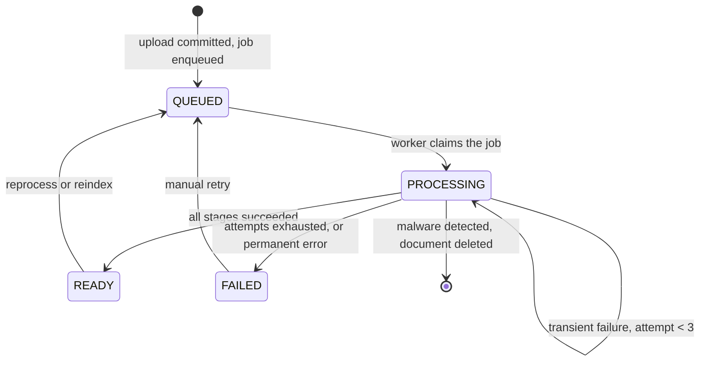

# 12 — Document Processing Pipeline

**Version:** 1.0  
**Date:** 2026-09-10  
**Author:** Engineering  
**Status:** Approved  
**Phase:** Release 1  

Everything that happens to a document between the upload response and the moment it is searchable: malware scanning, text extraction, OCR, AI classification, indexing, and the state machine, retry policy and idempotency guarantees that govern them. It applies to every document entering the system by any route, including the reset-state seeder.

**This document is the single source of truth for the pipeline. Cite it, do not repeat it.** Task cards, `05-module-definitions.md` 5.5 and `10-integration-points.md` reference these rules rather than restating them; if a rule changes, it changes here and nowhere else.

## 12.1 Decision matrix

| Concern | Decision | Rationale |
|---|---|---|
| Stage order | scan, extract, classify, index. Fixed, not configurable. | Scanning first is a security property. Nothing untrusted reaches a parser. |
| States | QUEUED, PROCESSING, READY, FAILED. Nothing else. | AC-44.01 shows the state to the user; a fifth state would need a label nobody has written. |
| Delivery guarantee | At-least-once, from BullMQ | Exactly-once across four external systems is not purchasable at this price |
| Idempotency | `process()` is a no-op on a READY document, and every stage is individually re-runnable | The direct consequence of at-least-once |
| Retry | 3 attempts, exponential backoff from 5 s, transient failures only | AC-44.02 |
| State during retry | Stays PROCESSING | AC-44.02 forbids a flicker to FAILED and back |
| Transient vs permanent | Network, timeout, 5xx and rate limit are transient. Malformed input, password protection and unreadable content are permanent and skip straight to FAILED. | Retrying a password-protected PDF three times wastes 9 minutes to reach the same answer |
| Failure blast radius | FAILED removes derived data only. The document stays listed, previewable and downloadable. | AC-44.03 |
| Malware outcome | Not a state. Document and blob are deleted and an audit event is written. | AC-46.02 requires the file never be reachable |
| Partial OCR | Per page. Some pages readable means READY with partial text. Every page failing means FAILED. | A 50-page scan with 2 bad pages is still worth 48 pages of search |
| Tag truncation | At write time, top 3 by confidence | AC-05.05. Truncating at read time leaves extra rows to leak through another query |
| Category on AI failure | Reserved `Uncategorized`, admin review queue | Converges with AC-06.03, so users see one outcome for two causes |
| Ordering between documents | None. Uploads are independent. | Nothing in the business docs requires FIFO across documents |
| Version processing | Each version processed independently | A new version must not invalidate the old version's extracted text |

## 12.2 State machine



Transitions are written with a guard on the current state, so a delayed duplicate job cannot move a READY document backwards.

## 12.3 Interface

```ts
// packages/enrichment/src/index.ts

export type ProcessingState = "queued" | "processing" | "ready" | "failed";

export type FailureReason =
  | "password_protected"     // "Dokumen terproteksi password"   AC-44.04
  | "unreadable_content"     // "Isi dokumen tidak dapat dibaca"  AC-44.05
  | "extraction_timeout"
  | "ai_unavailable"
  | "index_failed";

export interface EnrichmentService {
  /** Enqueue a document. Safe to call twice; the queue de-duplicates on jobId. */
  enqueue(documentId: DocumentId): Promise<void>;

  /**
   * Worker entry point. Idempotent: a READY document is a no-op.
   * Never throws to the caller; failures are recorded as state.
   */
  process(documentId: DocumentId): Promise<void>;

  getState(documentId: DocumentId): Promise<{
    state: ProcessingState;
    reason?: FailureReason;
    updatedAt: Date;
  }>;

  overrideField(
    documentId: DocumentId,
    field: AiField,
    value: string,
    actor: Principal,
  ): Promise<Result<void, Forbidden | NotFound>>;

  listTags(documentId: DocumentId): Promise<Tag[]>;
  topTags(tenantId: TenantId, limit?: number): Promise<TagCount[]>;
}
```

Job payload, deliberately minimal:

```ts
// jobId is the document id, so BullMQ de-duplicates in-flight jobs for free
await queue.add("process-document", { documentId }, {
  jobId: documentId,
  attempts: 3,
  backoff: { type: "exponential", delay: 5000 },
  removeOnComplete: { age: 3600, count: 1000 },
  removeOnFail: false,
});
```

The payload carries an id and nothing else. A payload carrying document fields would go stale between enqueue and execution, and would be a second source of truth for data that already lives in Postgres.

## 12.4 Stage contracts

| Stage | Input | Output | Permanent failures | Timeout |
|---|---|---|---|---|
| Scan | blob stream | clean, or a signature name | none; unreachable is transient and fails closed | 60 s |
| Extract native | blob | per-page text, page count | password protected, corrupt container | 60 s |
| OCR | page images for pages with no text layer | per-page text, confidence | unrenderable page | 180 s per page |
| Classify | truncated text, tenant category list | categoryId, confidence, type, tags, author, date | response fails schema validation twice | 60 s |
| Index | per-page text, metadata | acknowledged bulk write | mapping conflict | 5 s |

## 12.5 Performance targets

| Metric | Target | Source |
|---|---|---|
| Born-digital PDF, 50 pages, end to end | < 30 s | 08-nfr.md 8.3 |
| Scanned PDF, 50 pages, end to end | < 8 min | OCR-bound, 08-nfr.md 8.3 |
| Documents per hour, 4 workers | 200 to 400 | 08-nfr.md 8.3 |
| Queue depth alert | above 500 for 10 min | 08-nfr.md 8.7 |
| Failure rate alert | above 5% over 1 h | 08-nfr.md 8.7 |
| Index lag alert | above 60 s for 5 min | 08-nfr.md 8.7 |
| Time from READY to searchable | 0 s | Indexing is a stage, not a follow-up |

## 12.6 Concurrency and races

Three races are named in the acceptance criteria. Each is resolved by the database, not by application locking.

| Race | Resolution | Criterion |
|---|---|---|
| Two identical uploads at once | `UNIQUE (tenant_id, content_hash)`. The loser's insert fails and maps to `DuplicateContent`. | AC-03.04 |
| Two new versions of one document at once | `SELECT ... FOR UPDATE` on the parent row before allocating `version_number` | AC-21.04 |
| Duplicate job delivery | `jobId = documentId` de-duplicates in flight; the state guard handles a late redelivery | 12.1 |

Read-then-check is never acceptable for any of these. A `SELECT` that finds no duplicate followed by an `INSERT` is a race with a window measured in milliseconds, and AC-03.04 exists precisely to fail that implementation.

## 12.7 Rate limits and security constraints

1. AI calls are bounded by `AI_DAILY_TOKEN_BUDGET` per tenant per day. Exceeding it queues rather than drops, so no document is silently left unclassified.
2. A circuit breaker opens on the AI and OCR ports after ten consecutive failures, for five minutes.
3. Extracted text is passed to the model as data inside a structured prompt. The response is parsed against a Zod schema, and a `categoryId` outside the tenant's taxonomy is rejected rather than created. This is the containment for prompt injection through document content.
4. Scanning fails closed. A document is never marked READY unscanned.
5. No external call runs inside a database transaction.

## 12.8 Component and contract

```
packages/enrichment/
├── src/
│   ├── index.ts              EnrichmentService, the locked surface in 12.3
│   ├── ports.ts              MalwareScanner, TextExtractor, AiProvider
│   ├── pipeline.ts           Stage orchestration and the state machine
│   ├── stages/
│   │   ├── scan.ts
│   │   ├── extract.ts
│   │   ├── classify.ts
│   │   └── index-document.ts
│   ├── prompts/
│   │   └── classify.v1.ts    Versioned. A change here is a code change.
│   └── testing/
│       ├── stub-ai-provider.ts
│       ├── fixture-extractor.ts
│       └── always-clean-scanner.ts
```

## 12.9 What this does NOT do

| Not here | Why | Where it actually lives |
|---|---|---|
| Decide duplicate versus new version | That decision happens at upload, before a job exists | `catalog.upload`, matrix in 06-data-model.md 6.6 |
| Store the blob | The pipeline reads bytes, it never owns them | `catalog`, `BlobStore` port |
| Create categories | The AI selects from an existing taxonomy and never extends it | `classification`, grooming D3 |
| Enforce download permission | Processing has no view of who may read the result | `classification.canDownloadCategory` |
| Own the search index mapping | The pipeline calls `indexDocument` and knows nothing of the index | `search`, 13-search-indexing-strategy.md |
| Extract structured invoice fields | Roadmap US-25. The stage boundary exists; the extractor does not. | Deferred |
| Guarantee cross-document ordering | Nothing requires it, and enforcing it would serialise the queue | Not implemented |
| Notify a user on completion | No acceptance criterion asks for it. The UI polls state. | Not implemented |

## 12.10 Cross-references

| Concern | Source |
|---|---|
| Module surface and invariants | `05-module-definitions.md` 5.5 |
| Processing state columns and enums | `06-data-model.md` 6.5, 6.10.1 |
| Dedupe and version matrix | `06-data-model.md` 6.6 |
| Adapters, timeouts, circuit breakers | `10-integration-points.md` 10.3, 10.6, 10.7 |
| Throughput and alert thresholds | `08-nfr.md` 8.3, 8.7 |
| Indexing contract | `13-search-indexing-strategy.md` |
| Worker environment variables | `11-environment-configuration.md` 11.7 |
| Prompt-injection containment | `07-security.md` 7.8 |

## 12.11 Open follow-ups

| Item | Trigger to revisit |
|---|---|
| Structured field extraction for invoices | When US-25 leaves the roadmap |
| Dead-letter queue with an operator replay UI | When manual retry via the API proves insufficient in production |
| Per-tenant worker isolation | When one tenant's bulk upload starves another; the queue is shared today |
| Reprocessing after a model upgrade | When `AI_MODEL_CLASSIFY` changes and the accuracy baseline needs rebuilding |
| Parallel page OCR within one document | When p95 for a 50-page scan exceeds 8 minutes |
| Notification on completion | If users ask for it; state is currently polled |
